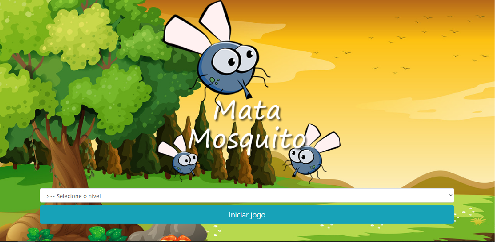

# Game_MataMosquito

O intuito desse projeto foi desenvolver um jogo relativamente simples, mas desafiou meus conhecimentos de lógica de programação e dominio da linguagem Javascript, e embora seja um projeto "simples" estou muito feliz com o resultado.

- Projeto desenvolvido com o apoio das aulas do professor @Jorge Sant Ana
- Por falta de habilidades com edição de imagens ainda não otimizei a responsividade do projeto
porem logo isso será concluido

### Tecnologias Utilizadas:
- HTML
- CSS
- Bootstrap
- Javascript

Visualize o projeto : https://elias2031.github.io/Game_MataMosquito/

